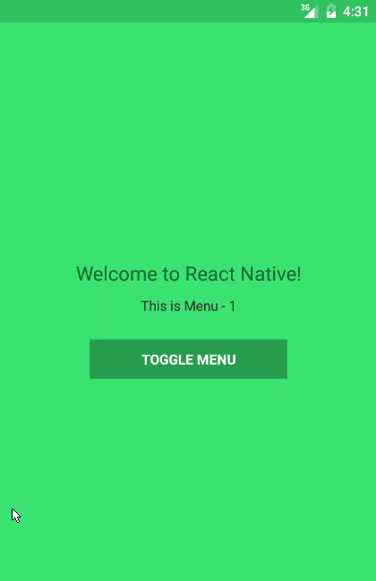

# react-native-off-canvas-menu
Beautifully crafted off canvas menu components for react native applications.

## Features -
* Gesture Support
* Orientation Compatible
* Smooth Animation
* Menu items with custom Icon support
* Scroll support for a long listed menu
* Automatically change scene for each menu item
* Hardware back button handling for Android

Created with [React Native Animated](https://facebook.github.io/react-native/docs/animated.html) library. The component is compatible with Android only. There is an example app with this repository in the `example` folder.


### OffCanvas3D


### OffCanvasReveal


## How to use
There is a bit of configuration needed to use the menu. First, install the component with NPM:

```bash
npm install react-native-off-canvas-menu --save
```

If you want to use the Icons with your menu titles, you can install the awesome library [react-native-vector-icons](https://github.com/oblador/react-native-vector-icons):

```bash
npm install react-native-vector-icons --save
```

Then you need to copy the font files (of Icons) from `[YourAppRoot]/node_modules/react-native-vector-icons/Fonts` to `[YourAppRoot]/android/app/src/main/assets/fonts` (create the folder if it doesn't exists). This is how you can use any custom font with your react-native app. Since we treat icons as fonts too, the process is same.

After installing components (or any library/component) and adding font's to your the assets folder, you need to restart the server and start the app again, otherwise they won't have any effect on the app. Now you have complete setup to use the component.

Import the components to your application:

```javascript
import Icon from 'react-native-vector-icons/EvilIcons'
import {OffCanvas3D} from 'react-native-off-canvas-menu'
```

Then, add a state object with a Boolean value to pass into the component  props for Open or Close state of the menu.

```javascript
this.state = {
  menuOpen: false
}
```

We also need a function to change the state and pass it as a props of the `OffCanvas3D` component. Add the following function to your component class:

```javascript
handleMenu() {
  const {menuOpen} = this.state
  this.setState({
    menuOpen: !menuOpen
  })
}
```

This state management can be done by [Redux](https://github.com/reactjs/redux), [MobX](https://github.com/mobxjs/mobx) or anything else. For simplicity, I used the vanilla component state. You can use yours.

Now, you can use the component inside of your render method:
```javascript
render() {
  return (
    <View style={{flex: 1}}>
      <OffCanvas3D
      active={this.state.menuOpen}
      onMenuPress={this.handleMenu.bind(this)}
      backgroundColor={'#222222'}
      menuTextStyles={{color: 'white'}}
      handleBackPress={true}
      menuItems={[
        {
          title: 'Menu 1',
          icon: <Icon name="camera" size={35} color='#ffffff' />,
          renderScene: <MyScene/>
        },
        {
          title: 'Menu 2',
          icon: <Icon name="bell" size={35} color='#ffffff' />,
          renderScene: <AnotherScene/>
        }
      ]}/>
    </View>
  )
}
```

There you go! Now you have a beautiful menu for your application :-)

## Component Props
###active
This is a Boolean type prop. It is required (`React.PropTypes.bool.isRequired`). It is the open and close state of the menu. You can use it for ..... only opening and closing the menu :-p

###onMenuPress
This is a function type prop. It is required (`React.PropTypes.func.isRequired`). This is the function which you need to pass to the component to let it close the menu when a menu item is pressed. This is React after all :D

###backgroundColor
This is a string type prop. It is not required (`React.PropTypes.string`). The default value is `#222222` (which is a nice color for background).

###menuTextStyles
This is a object type prop. It is not required (`React.PropTypes.object`). The default object is `{ color: 'white' }`. Since the menu title is a `<Text>` component, you can use any styling that is compatible with it.

###handleBackPress
This is a magic! Not really :-). This is a Boolean type prop. It is not required (`React.PropTypes.bool`). It adds a listener for the back button of Android devices when menu is opened and removes the listener when menu is closed. Default value is `true`.

###menuItems
This is where the magic happens, really!!!. It is an array type prop and oh yes, it is required (`React.PropTypes.array.isRequired`). You just need to pass an array of `title`, `icon` and `component` object, and boom, you got a navigation system with your menu! Here is the structure:

```javascript
{
  title: [Title for menu],
  icon: [An Icon component],
  renderScene: [Component to render]
}
```

**Example:**
```javascript
{
  title: 'Menu 1',
  icon: <Icon name="camera" size={35} color='#ffffff' />,
  renderScene: <MyScene/>
}
```

##License
[MIT License](https://github.com/shoumma/react-native-off-canvas-menu/blob/master/LICENSE). Do whatever you want to do.

## Credits
Thanks to React Native team for their awesome animation library. And thanks to all the online tutorial creators and blog writers who helped me a lot to learn stuffs.

I will be keep adding more variations of the component. So keep in touch with the repo. If you like the component, please show some love. If you discover any bug, please make an issue. I would really appreciate if anyone wants contribute to this repository.

Created with ♥ by [Provash Shoumma](https://twitter.com/pshoumma).
